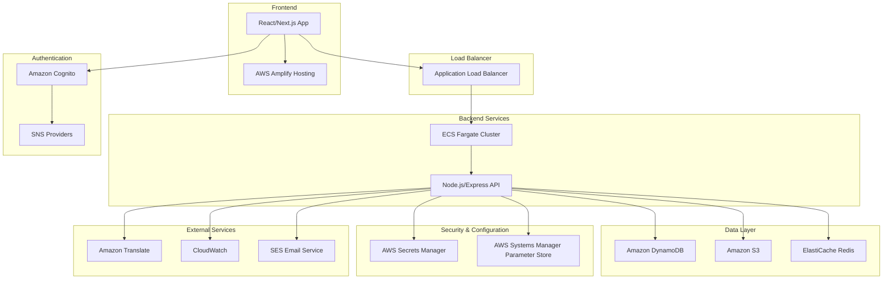

# 設計書

## 概要

AWSエンジニア向け多言語対応コミュニティサイトは、サーバーレスアーキテクチャを基盤とした拡張性の高いWebアプリケーションです。Amazon Translateによる自動翻訳機能、Amazon Cognitoによる認証システム、フォーラム機能を中心とした設計となっています。スモールスタートに適した構成でありながら、将来的な拡張性も考慮した設計です。

## アーキテクチャ

### システム全体構成



### 技術スタック選択理由

**フロントエンド: React/Next.js + AWS Amplify**
- SSR/SSGによるSEO最適化
- TypeScriptによる型安全性
- AWS Amplifyによる簡単なデプロイメント
- スモールスタートに適したコスト構造

**バックエンド: ECS Fargate + Node.js/Express**
- コンテナベースの柔軟な開発環境
- 自動スケーリング対応
- サーバーレスコンテナで運用コスト削減
- 複雑なビジネスロジックに適している

**データベース: Amazon DynamoDB**
- NoSQLによる高いスケーラビリティ
- 自動スケーリングでスモールスタートに最適
- 高速な読み書き性能
- 使用量ベースの課金モデル

## コンポーネントと インターフェース

### フロントエンドコンポーネント構成

```
src/
├── components/
│   ├── auth/
│   │   ├── LoginForm.tsx
│   │   ├── SignupForm.tsx
│   │   └── SocialLogin.tsx
│   ├── forum/
│   │   ├── PostList.tsx
│   │   ├── PostDetail.tsx
│   │   ├── PostEditor.tsx
│   │   └── ReplyThread.tsx
│   ├── common/
│   │   ├── Header.tsx
│   │   ├── Navigation.tsx
│   │   ├── LanguageSelector.tsx
│   │   └── ImageUpload.tsx
│   └── profile/
│       ├── UserProfile.tsx
│       └── Settings.tsx
├── pages/
│   ├── index.tsx
│   ├── login.tsx
│   ├── forum/
│   │   ├── [category].tsx
│   │   └── post/[id].tsx
│   └── profile/
│       └── [userId].tsx
├── hooks/
│   ├── useAuth.ts
│   ├── useTranslation.ts
│   └── useForum.ts
├── services/
│   ├── api.ts
│   ├── auth.ts
│   └── translation.ts
└── types/
    ├── user.ts
    ├── post.ts
    └── api.ts
```

### バックエンドAPI設計

**認証API**
```
POST /auth/login
POST /auth/signup
POST /auth/refresh
DELETE /auth/logout
GET /auth/profile
PUT /auth/profile
```

**フォーラムAPI**
```
GET /forum/categories
GET /forum/posts?category={category}&page={page}
POST /forum/posts
GET /forum/posts/{id}
PUT /forum/posts/{id}
DELETE /forum/posts/{id}
POST /forum/posts/{id}/replies
GET /forum/posts/{id}/replies
POST /forum/posts/{id}/reactions
```

**翻訳API**
```
POST /translate
GET /translate/cache/{hash}
```

**ファイルアップロードAPI**
```
POST /upload/image
GET /upload/presigned-url
```

### バックエンドサービス構成

```
backend/
├── src/
│   ├── controllers/
│   │   ├── authController.js
│   │   ├── forumController.js
│   │   ├── translationController.js
│   │   └── uploadController.js
│   ├── services/
│   │   ├── authService.js
│   │   ├── forumService.js
│   │   ├── translationService.js
│   │   └── uploadService.js
│   ├── models/
│   │   ├── userModel.js
│   │   ├── postModel.js
│   │   └── replyModel.js
│   ├── middleware/
│   │   ├── auth.js
│   │   ├── validation.js
│   │   └── errorHandler.js
│   ├── routes/
│   │   ├── auth.js
│   │   ├── forum.js
│   │   ├── translation.js
│   │   └── upload.js
│   └── utils/
│       ├── dynamodb.js
│       ├── s3.js
│       └── translate.js
├── Dockerfile
├── docker-compose.yml
└── package.json
```

## データモデル

### DynamoDBテーブル設計

**1. Usersテーブル**
```json
{
  "TableName": "Users",
  "KeySchema": [
    { "AttributeName": "id", "KeyType": "HASH" }
  ],
  "AttributeDefinitions": [
    { "AttributeName": "id", "AttributeType": "S" },
    { "AttributeName": "username", "AttributeType": "S" },
    { "AttributeName": "email", "AttributeType": "S" }
  ],
  "GlobalSecondaryIndexes": [
    {
      "IndexName": "username-index",
      "KeySchema": [{ "AttributeName": "username", "KeyType": "HASH" }]
    },
    {
      "IndexName": "email-index", 
      "KeySchema": [{ "AttributeName": "email", "KeyType": "HASH" }]
    }
  ]
}

// データ例
{
  "id": "user-123",
  "cognitoId": "cognito-456",
  "username": "aws_engineer_01",
  "email": "user@example.com",
  "displayName": "AWS Engineer",
  "avatarUrl": "https://s3.../avatar.jpg",
  "preferredLanguage": "ja",
  "awsCertifications": [
    {
      "name": "AWS Solutions Architect Associate",
      "level": "associate",
      "obtainedAt": "2023-01-15T00:00:00Z"
    }
  ],
  "specialties": ["EC2", "Lambda", "DynamoDB"],
  "createdAt": "2024-01-01T00:00:00Z",
  "updatedAt": "2024-01-01T00:00:00Z"
}
```

**2. Categoriesテーブル**
```json
{
  "TableName": "Categories",
  "KeySchema": [
    { "AttributeName": "id", "KeyType": "HASH" }
  ],
  "AttributeDefinitions": [
    { "AttributeName": "id", "AttributeType": "S" },
    { "AttributeName": "sortOrder", "AttributeType": "N" }
  ],
  "GlobalSecondaryIndexes": [
    {
      "IndexName": "sort-order-index",
      "KeySchema": [
        { "AttributeName": "sortOrder", "KeyType": "HASH" }
      ]
    }
  ]
}

// データ例
{
  "id": "category-ec2",
  "name": "Amazon EC2",
  "description": "EC2に関する質問と議論",
  "awsService": "EC2",
  "sortOrder": 1,
  "createdAt": "2024-01-01T00:00:00Z"
}
```

**3. Postsテーブル**
```json
{
  "TableName": "Posts",
  "KeySchema": [
    { "AttributeName": "id", "KeyType": "HASH" }
  ],
  "AttributeDefinitions": [
    { "AttributeName": "id", "AttributeType": "S" },
    { "AttributeName": "categoryId", "AttributeType": "S" },
    { "AttributeName": "createdAt", "AttributeType": "S" },
    { "AttributeName": "userId", "AttributeType": "S" }
  ],
  "GlobalSecondaryIndexes": [
    {
      "IndexName": "category-created-index",
      "KeySchema": [
        { "AttributeName": "categoryId", "KeyType": "HASH" },
        { "AttributeName": "createdAt", "KeyType": "RANGE" }
      ]
    },
    {
      "IndexName": "user-created-index",
      "KeySchema": [
        { "AttributeName": "userId", "KeyType": "HASH" },
        { "AttributeName": "createdAt", "KeyType": "RANGE" }
      ]
    }
  ]
}

// データ例
{
  "id": "post-123",
  "userId": "user-123",
  "categoryId": "category-ec2",
  "title": "EC2インスタンスの最適化について",
  "content": "EC2インスタンスのパフォーマンス最適化の方法を教えてください...",
  "originalLanguage": "ja",
  "tags": ["EC2", "performance", "optimization"],
  "imageUrls": ["https://s3.../image1.jpg"],
  "urlPreviews": [
    {
      "url": "https://docs.aws.amazon.com/ec2/",
      "title": "Amazon EC2 Documentation",
      "description": "EC2の公式ドキュメント",
      "imageUrl": "https://aws.amazon.com/favicon.ico"
    }
  ],
  "viewCount": 42,
  "reactionCounts": {
    "like": 5,
    "helpful": 3
  },
  "createdAt": "2024-01-01T12:00:00Z",
  "updatedAt": "2024-01-01T12:00:00Z"
}
```

**4. Repliesテーブル**
```json
{
  "TableName": "Replies",
  "KeySchema": [
    { "AttributeName": "postId", "KeyType": "HASH" },
    { "AttributeName": "id", "KeyType": "RANGE" }
  ],
  "AttributeDefinitions": [
    { "AttributeName": "postId", "AttributeType": "S" },
    { "AttributeName": "id", "AttributeType": "S" },
    { "AttributeName": "createdAt", "AttributeType": "S" }
  ],
  "LocalSecondaryIndexes": [
    {
      "IndexName": "post-created-index",
      "KeySchema": [
        { "AttributeName": "postId", "KeyType": "HASH" },
        { "AttributeName": "createdAt", "KeyType": "RANGE" }
      ]
    }
  ]
}

// データ例
{
  "postId": "post-123",
  "id": "reply-456",
  "userId": "user-789",
  "parentReplyId": null,
  "content": "EC2のインスタンスタイプを見直すことをお勧めします...",
  "originalLanguage": "ja",
  "imageUrls": [],
  "reactionCounts": {
    "like": 2,
    "helpful": 1
  },
  "createdAt": "2024-01-01T13:00:00Z",
  "updatedAt": "2024-01-01T13:00:00Z"
}
```

**5. TranslationCacheテーブル**
```json
{
  "TableName": "TranslationCache",
  "KeySchema": [
    { "AttributeName": "contentHash", "KeyType": "HASH" }
  ],
  "AttributeDefinitions": [
    { "AttributeName": "contentHash", "AttributeType": "S" }
  ],
  "TimeToLiveSpecification": {
    "AttributeName": "ttl",
    "Enabled": true
  }
}

// データ例
{
  "contentHash": "sha256-abc123...",
  "originalText": "EC2インスタンスの最適化について",
  "originalLanguage": "ja",
  "targetLanguage": "en",
  "translatedText": "About EC2 instance optimization",
  "createdAt": "2024-01-01T12:00:00Z",
  "ttl": 1735689600
}
```

**6. Reactionsテーブル**
```json
{
  "TableName": "Reactions",
  "KeySchema": [
    { "AttributeName": "targetId", "KeyType": "HASH" },
    { "AttributeName": "userIdReactionType", "KeyType": "RANGE" }
  ],
  "AttributeDefinitions": [
    { "AttributeName": "targetId", "AttributeType": "S" },
    { "AttributeName": "userIdReactionType", "AttributeType": "S" },
    { "AttributeName": "userId", "AttributeType": "S" }
  ],
  "GlobalSecondaryIndexes": [
    {
      "IndexName": "user-index",
      "KeySchema": [
        { "AttributeName": "userId", "KeyType": "HASH" }
      ]
    }
  ]
}

// データ例
{
  "targetId": "post-123",
  "userIdReactionType": "user-789#like",
  "userId": "user-789",
  "targetType": "post",
  "reactionType": "like",
  "createdAt": "2024-01-01T14:00:00Z"
}
```

### データ型定義（TypeScript）

```typescript
// ユーザー関連
interface User {
  id: string;
  cognitoId: string;
  username: string;
  email: string;
  displayName?: string;
  avatarUrl?: string;
  preferredLanguage: string;
  awsCertifications?: AWSCertification[];
  specialties: string[];
  createdAt: Date;
  updatedAt: Date;
}

interface AWSCertification {
  name: string;
  level: 'foundational' | 'associate' | 'professional' | 'specialty';
  obtainedAt: Date;
}

// フォーラム関連
interface Post {
  id: string;
  userId: string;
  categoryId: string;
  title: string;
  content: string;
  originalLanguage: string;
  tags: string[];
  imageUrls: string[];
  urlPreviews: URLPreview[];
  viewCount: number;
  reactionCounts: Record<string, number>;
  createdAt: Date;
  updatedAt: Date;
  user?: User;
  category?: Category;
  replies?: Reply[];
}

interface Reply {
  id: string;
  postId: string;
  userId: string;
  parentReplyId?: string;
  content: string;
  originalLanguage: string;
  imageUrls: string[];
  reactionCounts: Record<string, number>;
  createdAt: Date;
  updatedAt: Date;
  user?: User;
  childReplies?: Reply[];
}

interface Category {
  id: string;
  name: string;
  description?: string;
  awsService?: string;
  sortOrder: number;
  createdAt: Date;
}

interface URLPreview {
  url: string;
  title?: string;
  description?: string;
  imageUrl?: string;
  siteName?: string;
}
```

## シークレット管理設計

### AWS Secrets Manager構成

**1. シークレット分類**
```typescript
// データベース認証情報
interface DatabaseSecret {
  username: string;
  password: string;
  host: string;
  port: number;
  dbname: string;
}

// 外部API認証情報
interface APISecret {
  apiKey: string;
  secretKey?: string;
  endpoint?: string;
}

// JWT署名キー
interface JWTSecret {
  signingKey: string;
  refreshKey: string;
}
```

**2. シークレット命名規則**
```
環境/サービス/用途
例:
- prod/multilingual-community/database
- prod/multilingual-community/jwt-keys
- prod/multilingual-community/github-api
- prod/multilingual-community/translate-api
```

**3. シークレット取得サービス**
```typescript
class SecretsService {
  private client: SecretsManagerClient;
  private cache: Map<string, { value: any; expiry: number }>;

  async getSecret<T>(secretName: string): Promise<T> {
    // キャッシュチェック
    const cached = this.cache.get(secretName);
    if (cached && cached.expiry > Date.now()) {
      return cached.value;
    }

    try {
      const command = new GetSecretValueCommand({
        SecretId: secretName,
      });
      const response = await this.client.send(command);
      const secret = JSON.parse(response.SecretString!);
      
      // 5分間キャッシュ
      this.cache.set(secretName, {
        value: secret,
        expiry: Date.now() + 5 * 60 * 1000
      });
      
      return secret;
    } catch (error) {
      // フォールバック処理
      throw new SecretsManagerError(`Failed to retrieve secret: ${secretName}`);
    }
  }
}
```

**4. 自動ローテーション設定**
```json
{
  "RotationRules": {
    "AutomaticallyAfterDays": 30
  },
  "RotationLambdaARN": "arn:aws:lambda:region:account:function:SecretsManagerRotation"
}
```

### AWS Systems Manager Parameter Store構成

**1. 非機密設定値管理**
```
/multilingual-community/prod/app/region
/multilingual-community/prod/app/log-level
/multilingual-community/prod/dynamodb/table-prefix
/multilingual-community/prod/s3/bucket-name
/multilingual-community/prod/translate/source-languages
```

**2. パラメータ取得サービス**
```typescript
class ParameterService {
  private client: SSMClient;
  
  async getParameter(name: string): Promise<string> {
    const command = new GetParameterCommand({
      Name: name,
      WithDecryption: false // 非機密情報のため
    });
    
    const response = await this.client.send(command);
    return response.Parameter?.Value || '';
  }
  
  async getParameters(names: string[]): Promise<Record<string, string>> {
    const command = new GetParametersCommand({
      Names: names,
      WithDecryption: false
    });
    
    const response = await this.client.send(command);
    const result: Record<string, string> = {};
    
    response.Parameters?.forEach(param => {
      if (param.Name && param.Value) {
        result[param.Name] = param.Value;
      }
    });
    
    return result;
  }
}
```

## エラーハンドリング

### エラー分類と対応方針

**1. 認証エラー**
- 401 Unauthorized: トークン無効・期限切れ → 自動リフレッシュまたはログイン画面へ
- 403 Forbidden: 権限不足 → エラーメッセージ表示

**2. バリデーションエラー**
- 400 Bad Request: 入力値不正 → フィールド別エラーメッセージ表示
- 422 Unprocessable Entity: ビジネスルール違反 → 具体的なエラーメッセージ

**3. システムエラー**
- 500 Internal Server Error: サーバー内部エラー → 汎用エラーメッセージ + ログ記録
- 503 Service Unavailable: サービス一時停止 → メンテナンス画面表示

**4. 外部サービスエラー**
- 翻訳サービス障害: 元言語で表示 + 翻訳不可通知
- 画像アップロード失敗: リトライ機能 + 代替手段提示

**5. シークレット管理エラー**
- Secrets Manager接続失敗: フォールバック機能 + アラート送信
- シークレット取得失敗: リトライ機能 + 管理者通知
- シークレット復号化失敗: セキュリティログ記録 + サービス停止

### エラーレスポンス形式

```typescript
interface ErrorResponse {
  error: {
    code: string;
    message: string;
    details?: Record<string, string[]>;
    timestamp: string;
    requestId: string;
  };
}
```

### ログ設計

```typescript
interface LogEntry {
  timestamp: string;
  level: 'ERROR' | 'WARN' | 'INFO' | 'DEBUG';
  service: string;
  function: string;
  requestId: string;
  userId?: string;
  message: string;
  error?: {
    name: string;
    message: string;
    stack: string;
  };
  metadata?: Record<string, any>;
}
```

## テスト戦略

### テストピラミッド構成

**1. ユニットテスト（70%）**
- Node.js/Expressコントローラー・サービス関数テスト
- フロントエンドコンポーネントテスト
- ユーティリティ関数テスト
- データバリデーション関数テスト

**2. 統合テスト（20%）**
- ALB + ECS Fargate統合テスト
- DynamoDB操作テスト
- 外部サービス連携テスト（モック使用）
- 認証フローテスト

**3. E2Eテスト（10%）**
- ユーザー登録〜投稿作成フロー
- 多言語翻訳機能テスト
- 画像アップロード機能テスト
- レスポンシブデザインテスト

### テストツール選定

**フロントエンド**
- Jest + React Testing Library: コンポーネントテスト
- Cypress: E2Eテスト
- Storybook: コンポーネント開発・テスト

**バックエンド**
- Jest: Node.js/Expressアプリケーションユニットテスト
- Supertest: API統合テスト
- AWS SDK Mock: AWSサービスモック
- Docker: コンテナ環境でのテスト実行

### CI/CDパイプライン

```yaml
# GitHub Actions ワークフロー例
name: CI/CD Pipeline
on:
  push:
    branches: [main, develop]
  pull_request:
    branches: [main]

jobs:
  test:
    runs-on: ubuntu-latest
    steps:
      - uses: actions/checkout@v3
      - uses: actions/setup-node@v3
      - run: npm ci
      - run: npm run test:unit
      - run: npm run test:integration
      
  deploy:
    needs: test
    if: github.ref == 'refs/heads/main'
    runs-on: ubuntu-latest
    steps:
      - uses: actions/checkout@v3
      - run: docker build -t multilingual-community .
      - run: aws ecs update-service --cluster production --service api-service
```

### テストデータ管理

**開発・テスト用データ**
- ユーザー: 各言語設定のテストユーザー
- 投稿: 各AWSサービスカテゴリのサンプル投稿
- 翻訳: 主要言語ペアの翻訳サンプル

**データクリーンアップ**
- テスト実行前後の自動データリセット
- 個人情報を含まないダミーデータ使用